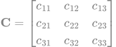

# IMU

Note all the matrices in here are just black svgs because GitHub readmes don't fully support latex. That means you will have a tough time reading any matrices in dark mode... sorry.

## Attitude Kinematics

Attitude kinematics deals with the orientation and rotation of a body in space. This document covers key concepts including reference frames, Direction Cosine Matrices (DCM), and quaternions.

### Reference Frames

Reference frames are essential for describing the position and orientation of objects in space. This section introduces different types of reference frames and their significance in attitude kinematics.

- **Inertial Frame**: A non-accelerating reference frame often used as a global frame of reference.
- **Body Frame**: A frame that moves with the body and is attached to it. It rotates relative to the inertial frame.

### DCM (Direction Cosine Matrix)

The Direction Cosine Matrix (DCM) is a matrix that describes the orientation of one reference frame with respect to another. It is used to convert vectors between different reference frames.

**Definition**: The DCM is a 3x3 orthogonal matrix where each element represents the cosine of the angle between the axes of the reference frames.

#### Example

A DCM matrix $\mathbf{C}$ can be represented as:

Where $c_{ij}$ are the direction cosines between the reference frame axes.

### Quaternions

Quaternions are a mathematical representation of rotation that extend complex numbers. They are particularly useful in 3D computations for representing and computing rotations.

- **Definition**: A quaternion $\mathbf{q}$ is defined as:
$\mathbf{q} = q_0 + q_1i + q_2j + q_3k$
Where $q_0$ is the scalar part and $q_1, q_2, q_3$ are the vector parts.

- **Advantages**:
  - **Compact Representation**: Requires four parameters instead of nine (DCM).
  - **Avoids Gimbal Lock**: No singularities in rotation representation.
  - **Efficient Computation**: Quaternion operations are computationally efficient.

#### Conversion

Quaternions can be converted to and from DCMs and Euler angles. This is useful for integrating different attitude representations in applications.

#### Example

Given a quaternion $\mathbf{q}$, the corresponding DCM $\mathbf{C}$ can be calculated as follows:

.svg>)

### Euler Angles

## Absolute Attitude Determination

### Quaternion Based Complementary Filter (w/ Adaptive Gain)

Sources: 
- https://ahrs.readthedocs.io/en/latest/filters/aqua.html#quaternion-based-complementary-filter
- https://www.mdpi.com/1424-8220/15/8/19302

Given gyroscope (angular velocity), accelermater (linear acceleration), magnatometer (magnetic field) measurements (and delta t), determine and propogate an absolute orientation quaternion.

Generally this method will work by combining the propogated gyroscope with the propogated accelerameter (roll, pitch) with the propogated magnatometer (yaw). 

Note this derivation is done on the quaternion that maps inertial to body coordinates. This is generally backwards but follows the sources above (they call inertial global and body local). 

#### Determine gyro orientation

1. Determine rate of change of quaternion

${B \atop I}q_{w,t_k} = {I \atop B}q_w^{-1}$

The above step is necessary as the quaternion we track in the code is the mapping from the body frame to the interial frame.

${B \atop I}\dot{q}_{w,t_k} = -\frac{1}{2} {B \atop }\mathbf{\omega}_{q,t_{k}} {B \atop I}q_{w,t_k}$

2. Propogate gyro orientation

${B \atop I}q_{w,t_k} = {B \atop I}q_{w,t_{k-1}} + {B \atop I}\dot{q}_{w,t_k} * \Delta t$

#### Determine Accel orientation

3. Find the predicted gravity vector in the inertial frame

${B \atop }\hat{a} = \frac{{B \atop }a}{||{B \atop }a||}$

$g = {I \atop }g_p = {B \atop I}q_{w,t_k}^{-1} * {B \atop }\hat{a} * {B \atop I}q_{w,t_k}$

4. Determine delta acc orientation

If g_z == -1, then TODO (shouldn't happen though).

)%7D%7D%5C%5C%5Cfrac%7Bg_x%7D%7B%5Csqrt%7B2(g_z&plus;1)%7D%7D%5C%5C0%5Cend%7Bbmatrix%7D$)

5. To reduce effect of high frequency noise preform interpolation between delta q_acc and identity quaternion. Use adaptive gain for alpha. Unclear what to set alpha bar to, .9 seems reasonable though https://link.springer.com/article/10.1023/A:1024157310388)

$\alpha = adaptiveAccelGain(\bar{\alpha}=.9, t_1=.1, t_2=.2)$

$\Delta q_{acc} = \Delta q_{acc}.interpolation([1, 0, 0, 0], \alpha=.5, \epsilon=.9)$

6. Combine with gryo orientation to correct roll and pitch

${B \atop I}q_{wa} = {B \atop I}q_{w} \Delta q_{acc}$

#### Determine Mag orientation

7. Get magnetic field vector in interial frame

${I \atop }m = {B \atop I}q_{wa}^{-1} * {B \atop }m * {B \atop I}q_{wa}$

8. Determine delta mag orientation

$\Gamma = m_x^2 + m_y^2$

%7D%7D%5Cend%7Bbmatrix%7D$)

9. To reduce effect of high frequency noise preform interpolation between delta q_mag and identity quaternion (alpha can be different from accelerameter. Unclear what to set it at, .9 seems reasonable though https://link.springer.com/article/10.1023/A:1024157310388)

$\Delta q_{mag} = \Delta q_{mag}.interpolation([1, 0, 0, 0], \alpha=.9, \epsilon=.9)$

10. Combine with gryo/acc orientation to correct yaw

${B \atop I}q = {B \atop I}q_{wa} \Delta q_{mag}$

${I \atop B}q = {B \atop I}q^{-1}$

This last q with the I over the B is what we want. This is the mapping from the body to interial frame as a quaternion and can be used as such:

${I \atop }r = {I \atop B}q * {B \atop }r * {I \atop B}q^{-1}$

